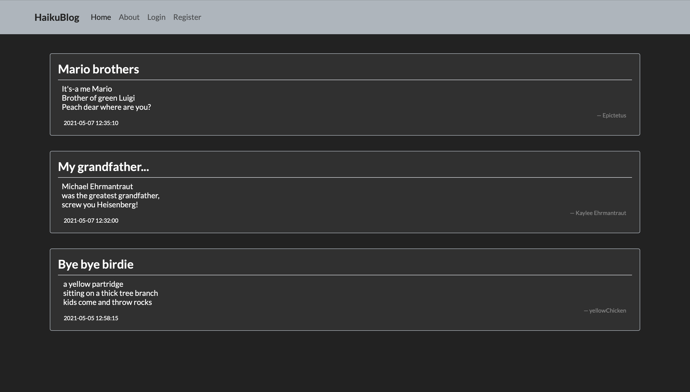
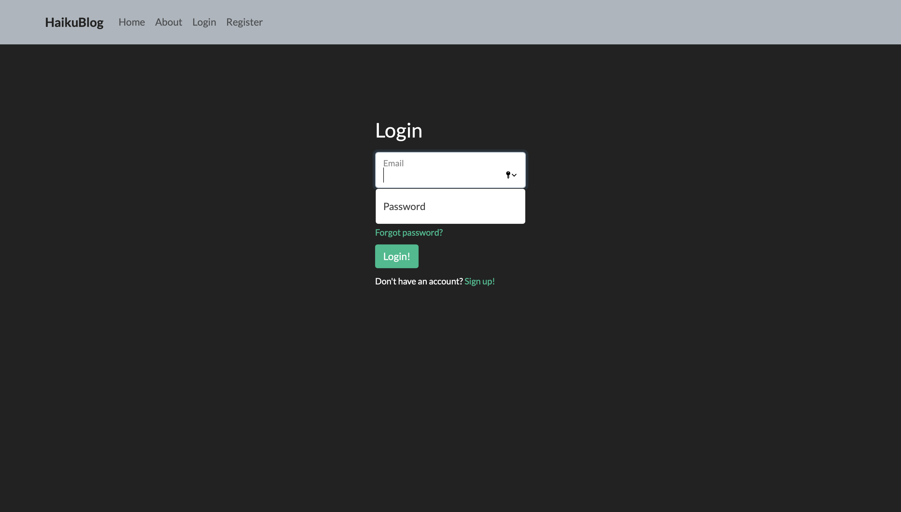
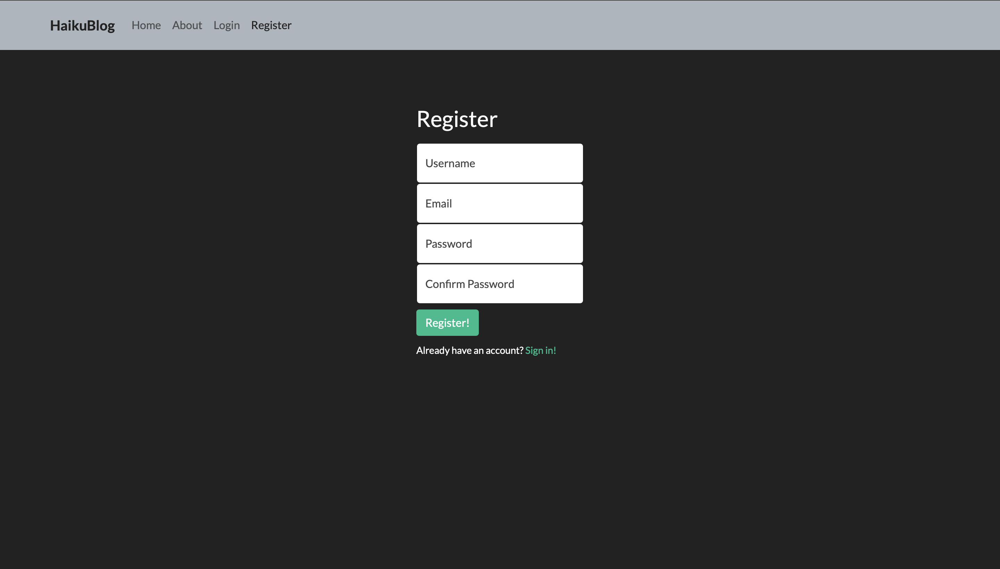
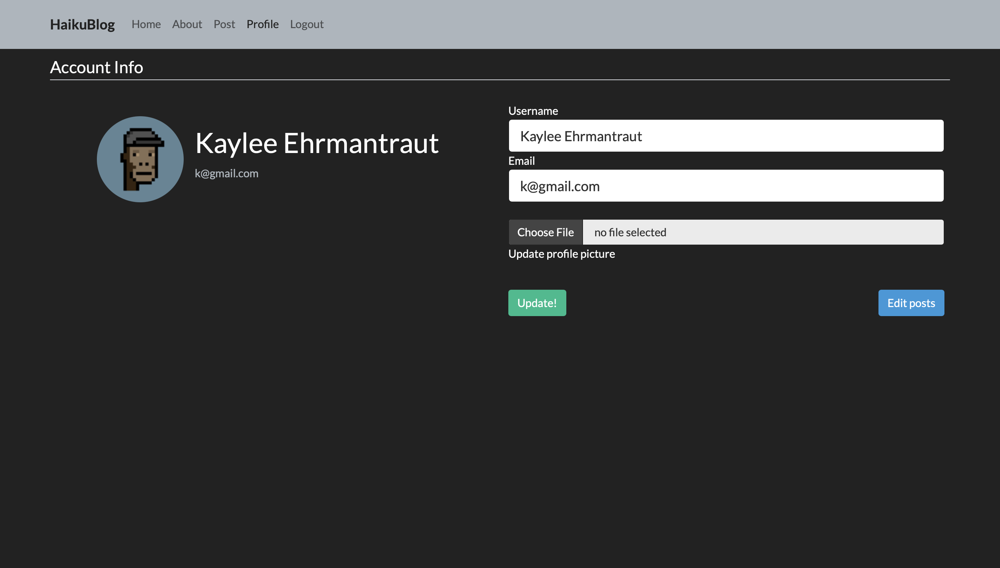

<h1>Haiku</h1>

Haiku is a japanese form of poetry, 17 syllabled poem  
in a 5-7-5 pattern

<i>This is a haiku   this is the middle of it   end of this haiku</i>

So the first line "<i>This is a haiku</i>" has 5 syllables,   next one has 7 syllables and last line has 5 syllables   thus making a haiku

<h1>HaikuBlog</h1>

Made this website as a CRUD project.
 
This project is made using
<ul>
  <li>Flask</li>
  <li>HTML/CSS</li>
  <li>MySQL</li>
</ul>

Includes login authentication using session cookies where you can change your username, email and profile picture.

<h1> Screenshots </h1>
<h3> Home page </h3>

<h3> Login page </h3>

<h3> Register page </h3>

<h3> Profile page </h3>

